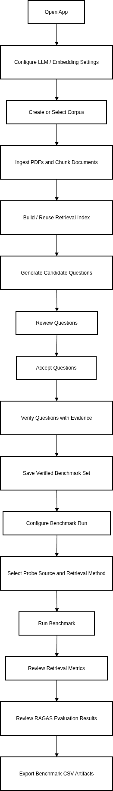

# RAG Benchmarking Suite

Streamlit app for building and evaluating paper-grounded RAG benchmarks with a human-in-the-loop workflow.

## User Flow



## What This Project Does

1. Ingests PDFs and creates deterministic text chunks.
2. Generates candidate questions per paper.
3. Queues accepted questions for human verification.
4. Verifies questions with retrieval-backed evidence selection.
5. Persists verified benchmark cases to JSON.
6. Runs source-aware retrieval benchmarks with parallel orchestration.
7. Exports benchmark summaries to PDF from persisted session snapshots.

## Current Benchmarking Capabilities

- Probe sources:
  - `auto` (auto-generated from chunk corpus)
  - `verified` (from `data/verified_questions.json`)
  - both can be enabled in a single run
- Retrieval methods:
  - `faiss` (implemented baseline)
  - `graphrag` and `lightrag` (registered placeholders, raise `NotImplementedError`)
- Parallel execution:
  - runs independent `source x retrieval_method` jobs concurrently
  - keeps results separated by source in `source_results`
- Compatibility layer:
  - improved contract for internal orchestration
  - legacy-compatible top-level fields for existing UI (`baseline`, `cases`, `tool_results`)
- Observability and reporting:
  - runtime estimation + telemetry persistence
  - benchmark snapshot persistence in Streamlit session state
  - PDF report generation from snapshot without rerunning benchmarks
  - CSV export of probe details and run metadata for successful benchmark runs
  - historical comparison dashboard across exported runs

## Repository Layout

```text
app.py
README.md
design_doc.md
requirements.txt

UI/
  components/
  pages/
  state/
  views/

Benchmark/
  benchmark_tools/
    api/
    contracts/
    observability/
    orchestration/
    probe_sources/
    reporting/
    retrieval_runners/
    adapters.py
    artifacts.py
    service.py
  domain/
  embedding/
  generation/
  ingestion/
  persistence/
  services/
  verification/
  tests/

data/
  rag_corpus_pdf/
  rag_corpus_text/
  rag_corpus_chunked/
  unverified_questions.json
  verified_questions.json
```

## Requirements

Base dependencies (`requirements.txt`):

- `streamlit[pdf]>=1.49.0`
- `pypdf>=4.2.0`
- `streamlit-sortables>=0.3.1`

Additional benchmark/indexing dependencies:

- `numpy`
- `faiss-cpu`
- `openai`
- `datasets`
- `ragas`
- `langchain-openai`
- `langchain-ollama`
- `ollama` (optional, for local LLM via Ollama server)

## Setup

```bash
./scripts/init_env.sh
```

Set your OpenAI API key (used for embeddings and answer generation where enabled):

```bash
export OPENAI_API_KEY="your_api_key"
```

Optional local LLM setup with Ollama:

```bash
ollama pull qwen3:8b
export LLM_PROVIDER="ollama"
export OLLAMA_BASE_URL="http://localhost:11434"
export OLLAMA_MODEL="qwen3:8b"
```

The script creates `.venv/`, upgrades packaging tools, and installs the base UI plus benchmark dependencies (`numpy`, `faiss-cpu`, `openai`, `datasets`, `ragas`, `langchain-openai`, `langchain-ollama`, and `pytest`).

## Run the App

```bash
streamlit run app.py
```

Default local URL is typically `http://localhost:8501`.

## End-to-End Workflow

### 1) Add PDFs

Put source PDFs in `data/rag_corpus_pdf/`.

### 2) Ingest and chunk

In **RAG Creation / Ingest**, run chunking.

Chunk output format:

- `data/rag_corpus_chunked/<paper_id>/<paper_id>_chunk_XXXX.txt`

Chunking defaults are configured in `Benchmark/config.py` (300 tokens with 60-token overlap).

### 3) Build FAISS index

```bash
python3 Benchmark/embedding/build_faiss_rag_index.py --overwrite
```

Expected index artifacts:

- `data/faiss_rag_index/chunks.faiss`
- `data/faiss_rag_index/chunks_metadata.jsonl`
- `data/faiss_rag_index/index_manifest.json`

### 4) Generate and accept questions

In **Query Creation / Question Generation**:

- Generate questions for the selected paper.
- Decline/regenerate as needed.
- Accept questions to append them to `data/unverified_questions.json`.

### 5) Verify questions

In **Query Creation / Verify Questions**:

- Load pending items from `data/unverified_questions.json`.
- Review retrieval candidates and select evidence chunks.
- Optionally generate/edit ground truth answer.
- On verify, order selected chunk IDs and save the record.

Persisted results:

- verified question appended to `data/verified_questions.json`
- question removed from `data/unverified_questions.json`

### 6) Run benchmarking

In **Benchmarking / Run Benchmarks**:

- Select probe sources (`auto`, `verified`, or both).
- Select retrieval methods (use `faiss` for executable runs).
- Select benchmark tool (`ragas`).
- Run benchmark and review source-separated results.
- Export a PDF report from the stored benchmark snapshot.

Successful runs also write CSV artifacts under `data/benchmark_runs/csv_exports/`:

- `<run_id>_probe_details.csv`
  - one row per benchmark case with retrieval outputs and stored per-case RAGAS scores
- `<run_id>_metadata.csv`
  - one row per completed source/method branch with run timestamp, models, probe counts, top-k, duration, and index metadata

### 7) Compare benchmarking runs

In **Benchmarking / Compare Benchmarks**:

- Select 1-5 exported benchmark runs.
- Compare retrieval and RAGAS metrics in a color-coded dashboard.
- Review benchmark duration and probe mix side by side.
- Use the run legend (`Run A`, `Run B`, etc.) to map compact dashboard labels back to full run identities.
- Download a standalone HTML dashboard snapshot for sharing or offline review.

## Benchmarking Architecture

`Benchmark/benchmark_tools` is intentionally layered:

- `contracts/`: request validation and normalized contracts
- `probe_sources/`: probe loading/composition by source
- `retrieval_runners/`: retrieval strategy abstraction and runner registry
- `orchestration/`: deterministic job planning, parallel execution, result merge
- `observability/`: runtime estimation and telemetry persistence
- `reporting/`: report view model and PDF generation
- `api/service.py`: public service entrypoints
- `api/compat.py`: improved-to-legacy result mapping

### Service entrypoints

- `run_improved_benchmarks(*, request: dict) -> dict`
  - returns improved source-separated contract
- `run_retrieval_benchmarks(...) -> dict`
  - returns legacy-compatible keys for current UI consumers

## Key Data Artifacts

- `data/unverified_questions.json`
  - accepted questions pending verification
- `data/verified_questions.json`
  - finalized benchmark questions with ground truth and ordered evidence
- `data/question_id_counter.txt`
  - persistent global sequential question ID allocator
- `data/benchmark_runs/csv_exports/`
  - exported benchmark comparison artifacts (`*_probe_details.csv`, `*_metadata.csv`)

## Testing

Run benchmark-focused tests:

```bash
pytest Benchmark/tests -q
```

## Notes

- `streamlit-sortables` is required for drag-ordering evidence chunks in verification.
- If `OPENAI_API_KEY` is missing or invalid, model-dependent features may fail or be unavailable.
- For local generation, ensure Ollama is running and `qwen3:8b` is installed (`ollama pull qwen3:8b`).
- For implementation-level handoff details and phased status, see `design_doc.md`.
